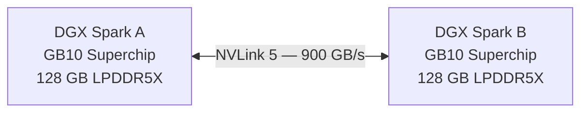
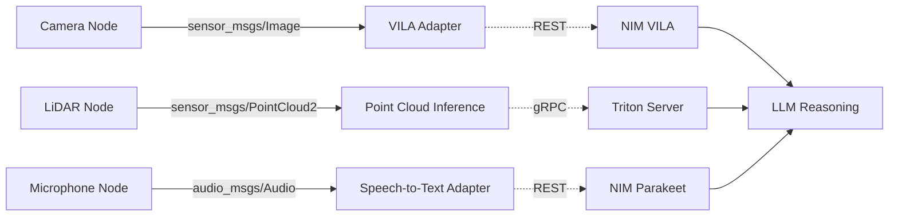

# NVIDIA DGX Spark

*Foundation Models & ROS 2 Integration*

**Author:** Ricardo Sanz  
**Date:** 2026-07-22

## Table of Contents

- [Preface](#preface)
- [DGX Spark Hardware Architecture](#dgx-spark-hardware-architecture)
  - [Overview](#overview)
  - [The GB10 Grace Blackwell Superchip](#the-gb10-grace-blackwell-superchip)
    - [NVLink-C2C Interconnect](#nvlink-c2c-interconnect)
    - [Blackwell GPU Architecture](#blackwell-gpu-architecture)
    - [Grace CPU](#grace-cpu)
  - [DGX Spark Interconnect and Multi-Node Scaling](#dgx-spark-interconnect-and-multi-node-scaling)
  - [Thermal Design and Power Management](#thermal-design-and-power-management)
- [System Setup and Initial Configuration](#system-setup-and-initial-configuration)
  - [Unboxing and Physical Setup](#unboxing-and-physical-setup)
  - [DGX OS Fundamentals](#dgx-os-fundamentals)
    - [First Boot](#first-boot)
    - [Verifying the Installation](#verifying-the-installation)
  - [Software Updates](#software-updates)
  - [Remote Access Configuration](#remote-access-configuration)
    - [SSH Access](#ssh-access)
    - [ASLab DGX Spark — Shared Remote Access](#aslab-dgx-spark-shared-remote-access)
    - [JupyterLab Server](#jupyterlab-server)
  - [NVIDIA Container Toolkit](#nvidia-container-toolkit)
- [Networking and Storage](#networking-and-storage)
  - [Network Topology for AI Workloads](#network-topology-for-ai-workloads)
  - [Storage Configuration](#storage-configuration)
    - [NVMe Layout](#nvme-layout)
    - [NFS Mount for Shared Model Weights](#nfs-mount-for-shared-model-weights)
- [Deploying Foundation Models with NVIDIA NIM](#deploying-foundation-models-with-nvidia-nim)
  - [What is NVIDIA NIM?](#what-is-nvidia-nim)
  - [NGC Credentials Setup](#ngc-credentials-setup)
  - [Deploying a Large Language Model](#deploying-a-large-language-model)
    - [Llama 3 8B Instruct via NIM](#llama-3-8b-instruct-via-nim)
    - [Verifying the Endpoint](#verifying-the-endpoint)
  - [Deploying a Vision-Language Model](#deploying-a-vision-language-model)
    - [NVIDIA VILA 1.5 (Visual Language)](#nvidia-vila-15-visual-language)
  - [Deploying an Embedding Model](#deploying-an-embedding-model)
- [NVIDIA Triton Inference Server](#nvidia-triton-inference-server)
  - [Overview of Triton](#overview-of-triton)
  - [Model Repository Layout](#model-repository-layout)
    - [Example config.pbtxt](#example-configpbtxt)
  - [Launching Triton](#launching-triton)
    - [Querying Triton from Python](#querying-triton-from-python)
- [Model Optimisation with TensorRT-LLM](#model-optimisation-with-tensorrt-llm)
  - [Why Optimise?](#why-optimise)
  - [Converting a HuggingFace Model to TensorRT-LLM](#converting-a-huggingface-model-to-tensorrt-llm)
- [Installing and Configuring ROS 2](#installing-and-configuring-ros2)
  - [ROS 2 Distribution Selection](#ros2-distribution-selection)
  - [Installation](#installation)
  - [DDS Configuration for AI Workloads](#dds-configuration-for-ai-workloads)
  - [Workspace Setup](#workspace-setup)
- [Connecting ROS 2 to Foundation Models](#connecting-ros2-to-foundation-models)
  - [Architecture Overview](#architecture-overview)
  - [Writing a NIM Adapter Node](#writing-a-nim-adapter-node)
    - [Package Structure](#package-structure)
    - [LLM Service Node](#llm-service-node)
  - [Image-to-Text Adapter for Vision Models](#image-to-text-adapter-for-vision-models)
  - [Building and Running](#building-and-running)
- [Building AI-Powered Robotics Pipelines](#building-ai-powered-robotics-pipelines)
  - [Autonomous Navigation with LLM Scene Understanding](#autonomous-navigation-with-llm-scene-understanding)
    - [Custom ROS 2 Message Types](#custom-ros2-message-types)
    - [Navigation Reasoning Node](#navigation-reasoning-node)
  - [Retrieval-Augmented Generation for Robot Knowledge](#retrieval-augmented-generation-for-robot-knowledge)
    - [Embedding and Storing Operational Documents](#embedding-and-storing-operational-documents)
  - [Launch Files](#launch-files)
- [Performance Monitoring and Tuning](#performance-monitoring-and-tuning)
  - [GPU Monitoring](#gpu-monitoring)
  - [NIM Metrics with Prometheus](#nim-metrics-with-prometheus)
  - [Tuning NIM for ROS 2 Workloads](#tuning-nim-for-ros2-workloads)
  - [ROS 2 Executor and Threading](#ros2-executor-and-threading)
- [Security and Production Hardening](#security-and-production-hardening)
  - [Isolating Inference Services](#isolating-inference-services)
  - [TLS for NIM REST Endpoints](#tls-for-nim-rest-endpoints)
  - [Role-Based Access for Multi-User Labs](#role-based-access-for-multi-user-labs)
- [Exercises](#exercises)
  - [Module 1 — System Setup](#module-1-system-setup)
  - [Module 2 — Foundation Model Deployment](#module-2-foundation-model-deployment)
  - [Module 3 — ROS 2 Integration](#module-3-ros2-integration)
  - [Module 4 — Advanced Topics](#module-4-advanced-topics)
- [Command Reference Summary](#command-reference-summary)
  - [Hardware and System](#hardware-and-system)
  - [Docker and Container Toolkit](#docker-and-container-toolkit)
  - [NGC and NIM](#ngc-and-nim)
  - [TensorRT-LLM](#tensorrt-llm)
  - [Triton Inference Server](#triton-inference-server)
  - [ROS 2 Core Commands](#ros2-core-commands)
  - [DDS and Network Tuning](#dds-and-network-tuning)
  - [Storage and NFS](#storage-and-nfs)
- [Running Kimi K3 on the DGX Spark](#running-kimi-k3-on-the-dgx-spark)
  - [About Kimi K3](#about-kimi-k3)
  - [Hardware Feasibility on a Single DGX Spark](#hardware-feasibility-on-a-single-dgx-spark)
  - [Option A: Quantised Local Inference with llama.cpp](#option-a-quantised-local-inference-with-llamacpp)
    - [Building llama.cpp with CUDA Support](#building-llamacpp-with-cuda-support)
    - [Downloading Quantised Weights](#downloading-quantised-weights)
    - [Launching the Server with Expert Offload](#launching-the-server-with-expert-offload)
    - [Querying the Endpoint](#querying-the-endpoint)
  - [Option B: Multi-Node Serving with vLLM (DGX Spark Dual)](#option-b-multi-node-serving-with-vllm-dgx-spark-dual)
  - [Connecting to ROS 2](#connecting-to-ros2)
  - [Performance Tuning Notes](#performance-tuning-notes)
- [References](#references)

# Preface

This manual provides a comprehensive guide to deploying and operating the **NVIDIA DGX Spark** system, with special emphasis on integrating large-scale foundation models with the **Robot Operating System 2 (ROS 2)** middleware. It targets robotics engineers, AI researchers, and systems integrators who need to bring state-of-the-art AI capabilities into real-time robotic and autonomous systems.

The document is organized into three parts:

- **Part I — Hardware & System Setup:** Chapters 1–3 cover the DGX Spark hardware architecture, initial system configuration, software stack installation, and network provisioning.

- **Part II — Foundation Model Deployment:** Chapters 4–6 address pulling, configuring, and serving large language and multimodal models using NVIDIA NIM and Triton Inference Server.

- **Part III — ROS 2 Integration:** Chapters 7–10 detail how to connect ROS 2 nodes to inference endpoints, build perception and reasoning pipelines, and deploy complete robot autonomy stacks.

Three appendices complete the manual: **Appendix A** provides a graduated collection of hands-on exercises, **Appendix B** offers a quick-reference summary of all commands introduced in the text, and **Appendix C** walks through deploying the Kimi K3 open-weight model on the DGX Spark.

> **Note:** All commands, configuration snippets, and version numbers in this manual reflect the software versions available at the time of writing. Always verify against the latest NVIDIA and ROS 2 release notes before deploying in production.

# DGX Spark Hardware Architecture

## Overview

The **NVIDIA DGX Spark** is a compact, energy-efficient personal AI supercomputer built around the **GB10 Grace Blackwell Superchip**. It bridges the gap between cloud-scale GPU clusters and edge deployment, enabling researchers and engineers to run multi-billion-parameter foundation models on a single desktop-class appliance.

<div id="tab:dgx_specs">

| **Component**     | Specification                                          |
|:------------------|:-------------------------------------------------------|
| **Superchip**     | NVIDIA GB10 Grace Blackwell Superchip                  |
| **GPU**           | 1× Blackwell GPU (up to 1 PFLOPS FP4 AI)        |
| **CPU**           | 20-core NVIDIA Grace CPU (Arm Neoverse V2)             |
| **GPU Memory**    | 128 GB LPDDR5X unified memory (CPU+GPU)                |
| **System Memory** | 128 GB LPDDR5X (shared with GPU via NVLink-C2C)        |
| **Storage**       | 4 TB NVMe SSD                                          |
| **Networking**    | 2× 10 GbE, 1× OSFP (800 Gb/s ConnectX-8) |
| **USB**           | 3× USB 3.2, 1× USB4                      |
| **Display**       | 1× HDMI 2.1                                     |
| **Power**         | 170 W TDP                                              |
| **Dimensions**    | 268 × 268 × 74 mm                        |
| **Weight**        | 3.9 kg                                                 |
| **OS**            | DGX OS (Ubuntu 22.04-based)                            |

NVIDIA DGX Spark — Key Specifications

</div>

## The GB10 Grace Blackwell Superchip

### NVLink-C2C Interconnect

The defining feature of the GB10 is its **NVLink-C2C** (Chip-to-Chip) interconnect, which couples the Grace CPU and Blackwell GPU on a single substrate with a bandwidth of **900 GB/s**. This eliminates traditional PCIe bottlenecks and enables the GPU to access the full 128 GB system memory as a *unified* pool, critical for loading large model checkpoints without staging.

### Blackwell GPU Architecture

The Blackwell GPU inside the GB10 introduces:

- **5th-generation Tensor Cores** supporting FP4/FP8/FP16/BF16/TF32/FP64 precision

- **2nd-generation Transformer Engine** with hardware-accelerated attention

- **NVLink 5** for multi-node scale-out

- Dedicated decompression hardware for sparse models

### Grace CPU

The 20-core ARM Neoverse V2 CPU offers:

- SVE2 (Scalable Vector Extension 2) for SIMD-accelerated ROS 2 message processing

- Hardware memory tagging (MTE) for safe robotics runtime environments

- 60 MB L3 cache shared among all cores

## DGX Spark Interconnect and Multi-Node Scaling

A single DGX Spark can be **NVLink-connected to a second unit** via the OSFP port, effectively forming a 2-node cluster with 256 GB of unified memory and doubled compute throughput. This is referred to as the **DGX Spark Dual** configuration and requires no special software changes — the CUDA runtime and NVLink fabric manager handle topology detection automatically.

<a id="fig:nvlink_dual"></a>



*Figure: DGX Spark Dual NVLink configuration — combined 256 GB unified memory pool*

## Thermal Design and Power Management

The DGX Spark uses a vapour-chamber cooling system paired with a variable-speed fan array. Thermal Design Power (TDP) is 170 W under full GPU load, making it compatible with standard 100–240 V outlets. The NVIDIA System Management Interface (`nvidia-smi`) exposes power capping and fan-speed overrides.

# System Setup and Initial Configuration

## Unboxing and Physical Setup

1.  Connect power (supplied 200 W GaN adapter) to the rear DC jack.

2.  Attach a monitor via HDMI 2.1 for initial configuration; remote access is configured in Section [2.4](#sec:remote).

3.  Connect the Ethernet cable to the 10 GbE port labelled **MGT** for management traffic.

4.  Press the front power button. The status LED turns <span style="color: CSGreen">green</span> when the DGX OS is ready.

## DGX OS Fundamentals

DGX OS is a hardened Ubuntu 22.04 LTS derivative that ships with:

- NVIDIA GPU drivers (Blackwell-series, open-kernel module)

- CUDA Toolkit 12.x

- NVIDIA Container Toolkit (nvidia-docker2)

- DGX System Manager (`dgxsm`)

- NVLink Fabric Manager

### First Boot

On first boot the system runs the **DGX Setup Wizard**, which configures:

- Locale, timezone, and keyboard layout

- Administrator account (`dgxuser` by default)

- Static vs. DHCP networking

- Proxy settings (for air-gapped environments)

### Verifying the Installation

**Verifying CUDA and GPU detection**

``` bash
# Check CUDA version
nvcc --version

# List GPU topology
nvidia-smi topo -m

# Confirm NVLink bandwidth (Dual config only)
nvidia-smi nvlink -s

# Show GPU utilisation
nvidia-smi dmon -s u
```

## Software Updates

**System and DGX software update procedure**

``` bash
sudo apt update && sudo apt upgrade -y

# Update DGX-specific packages
sudo apt install --only-upgrade dgx-release-files

# Firmware update (reboots automatically)
sudo dgxsm firmware update
```

<a id="sec:remote"></a>

## Remote Access Configuration

### SSH Access

**Enabling and hardening SSH**

``` bash
sudo systemctl enable --now ssh

# Generate key pair on the client machine (not the DGX Spark)
ssh-keygen -t ed25519 -C "my_workstation"
ssh-copy-id dgxuser@<dgx_spark_ip>

# On the DGX Spark: disable password authentication
sudo sed -i 's/^#PasswordAuthentication yes/PasswordAuthentication no/' \
  /etc/ssh/sshd_config
sudo systemctl restart ssh
```

### ASLab DGX Spark — Shared Remote Access

The MATATOOL and CORESENSE project teams share a DGX Spark hosted by ASLab at `dgx.aslab.upm.es`.

**Connecting to the ASLab DGX Spark**

``` bash
ssh <your-upm-username>@dgx.aslab.upm.es
```

> **Note:**
>
> **Administrator:** Ricardo Sanz ([ricardo.sanz@upm.es](mailto:ricardo.sanz@upm.es)) — contact to request an account, reset access, or resolve conflicts.
>
> **Usage policy (single-GPU, shared by a 5–10 person team):**
>
> - This DGX Spark has **one** GPU. Before starting any job, check it is free with `nvidia-smi`; do not launch competing workloads on top of someone else's running job.
> - Announce long-running jobs (training, fine-tuning, batch inference) in the team channel with expected duration, and run them inside `tmux` or `screen` so others can check status without killing your session.
> - For short interactive/exploratory work, release the GPU (stop the container/process) as soon as you are done — do not leave idle NIM/Triton containers holding GPU memory.
> - Prefix containers, model caches, and background jobs with your project name and username (e.g. `coresense-rsanz-llama3`, `matatool-jdoe-vila`) so others can identify ownership with `docker ps`.
> - Store project data and checkpoints under `/raid/{matatool,coresense}/<username>/` rather than `/home`, and clean up large checkpoints once a project milestone is done — the NVMe is shared, not per-user quota'd.
> - If you need guaranteed exclusive access for a scheduled run, coordinate a time slot with the rest of the team in advance.

### JupyterLab Server

**Installing and launching JupyterLab via Docker**

``` bash
docker run -d --gpus all \
  -p 8888:8888 \
  -v ~/notebooks:/home/jovyan/work \
  --name jupyterlab \
  nvcr.io/nvidia/pytorch:24.05-py3 \
  jupyter lab --ip=0.0.0.0 --no-browser --NotebookApp.token='dgxspark'
```

## NVIDIA Container Toolkit

The Container Toolkit enables GPU access from Docker containers without device-file boilerplate.

**Container Toolkit installation (if not pre-installed)**

``` bash
distribution=$(. /etc/os-release; echo "$ID$VERSION_ID")
curl -s -L https://nvidia.github.io/libnvidia-container/gpgkey | \
  sudo gpg --dearmor -o /usr/share/keyrings/nvidia-container-toolkit.gpg

curl -s -L \
  https://nvidia.github.io/libnvidia-container/$distribution/libnvidia-container.list | \
  sudo tee /etc/apt/sources.list.d/nvidia-container-toolkit.list

sudo apt update
sudo apt install -y nvidia-container-toolkit
sudo nvidia-ctk runtime configure --runtime=docker
sudo systemctl restart docker
```

**Verifying GPU access inside a container**

``` bash
docker run --rm --gpus all \
  nvcr.io/nvidia/cuda:12.4.1-base-ubuntu22.04 \
  nvidia-smi
```

# Networking and Storage

## Network Topology for AI Workloads

For multi-DGX Spark environments and low-latency ROS 2 communication, a dedicated **AI fabric** is recommended alongside the management network:

<div id="tab:network">

| Network       | Purpose                                      | Interface              |
|:--------------|:---------------------------------------------|:-----------------------|
| Management    | SSH, monitoring, OS updates                  | `eth0` (10 GbE)        |
| AI Fabric     | Model weights transfer, NIM API, Triton gRPC | `eth1` (10 GbE)        |
| ROS 2 DDS     | Real-time topic communication                | `eth0` (isolated VLAN) |
| NVLink Fabric | Dual-node GPU interconnect                   | OSFP                   |

Recommended network segmentation

</div>

## Storage Configuration

### NVMe Layout

The 4 TB NVMe is partitioned at the factory as follows:

- **/** — 100 GB (OS and software)

- **/home** — 200 GB (user files)

- **/raid** — remaining space (model checkpoints, datasets)

### NFS Mount for Shared Model Weights

In a lab with multiple DGX Sparks, exporting model weights via NFS avoids duplicating multi-hundred-GB checkpoints.

**Setting up an NFS export for model weights**

``` bash
# On the primary DGX Spark (server)
sudo apt install -y nfs-kernel-server
sudo mkdir -p /raid/models
sudo chown nobody:nogroup /raid/models

# Add export
echo "/raid/models  *(rw,sync,no_subtree_check,no_root_squash)" | \
  sudo tee -a /etc/exports
sudo exportfs -a
sudo systemctl restart nfs-server

# On each client DGX Spark
sudo mkdir -p /mnt/models
sudo mount -t nfs <server_ip>:/raid/models /mnt/models
```

# Deploying Foundation Models with NVIDIA NIM

## What is NVIDIA NIM?

**NVIDIA NIM** (NVIDIA Inference Microservices) is a collection of optimised, containerised inference engines that wrap popular foundation models — LLMs, vision transformers, speech models — behind a standardised **OpenAI-compatible REST API**. NIM containers are pre-tuned for specific NVIDIA GPU architectures and include:

- TensorRT-LLM engines (quantised and optimised for Blackwell)

- Automatic batching and KV-cache management

- Streaming and non-streaming completion endpoints

- OpenTelemetry-based metrics compatible with Prometheus

## NGC Credentials Setup

**Authenticating with NVIDIA NGC**

``` bash
# Install NGC CLI
wget -O ngccli.zip https://ngc.nvidia.com/downloads/ngccli_linux.zip
unzip -o ngccli.zip && chmod +x ngc-cli/ngc
sudo mv ngc-cli/ngc /usr/local/bin/

# Configure with your API key (obtain from ngc.nvidia.com)
ngc config set

# Log in to the container registry
echo "<NGC_API_KEY>" | docker login nvcr.io \
  --username '$oauthtoken' --password-stdin
```

## Deploying a Large Language Model

### Llama 3 8B Instruct via NIM

**Pulling and running Llama 3 8B NIM**

``` bash
# Pull the NIM image
docker pull nvcr.io/nim/meta/llama3-8b-instruct:1.0.3

# Create a directory for model cache
mkdir -p ~/.cache/nim/llama3-8b

# Launch the NIM container
docker run -d \
  --gpus all \
  --shm-size 16g \
  -e NGC_API_KEY=<YOUR_KEY> \
  -p 8000:8000 \
  -v ~/.cache/nim/llama3-8b:/opt/nim/.cache \
  --name llama3-8b \
  nvcr.io/nim/meta/llama3-8b-instruct:1.0.3
```

### Verifying the Endpoint

**Health check and first inference call**

``` bash
# Wait for the model to load (watch logs)
docker logs -f llama3-8b

# Health check
curl http://localhost:8000/v1/health/ready

# Chat completion
curl -X POST http://localhost:8000/v1/chat/completions \
  -H "Content-Type: application/json" \
  -d '{
    "model": "meta/llama3-8b-instruct",
    "messages": [{"role":"user","content":"Hello DGX Spark!"}],
    "max_tokens": 128,
    "stream": false
  }'
```

## Deploying a Vision-Language Model

### NVIDIA VILA 1.5 (Visual Language)

**Launching VILA 1.5 for multimodal inference**

``` bash
docker run -d \
  --gpus all \
  -e NGC_API_KEY=<YOUR_KEY> \
  -p 8001:8000 \
  -v ~/.cache/nim/vila:/opt/nim/.cache \
  --name vila-15 \
  nvcr.io/nim/nvidia/vila:1.5-40b
```

**Python client for image+text query**

``` python
import base64, requests

def encode_image(path: str) -> str:
    with open(path, "rb") as f:
        return base64.b64encode(f.read()).decode()

payload = {
    "model": "nvidia/vila-1.5-40b",
    "messages": [{
        "role": "user",
        "content": [
            {"type": "image_url",
             "image_url": {"url": f"data:image/jpeg;base64,{encode_image('/tmp/scene.jpg')}"}},
            {"type": "text", "text": "Describe every obstacle visible in this scene."}
        ]
    }],
    "max_tokens": 256
}
resp = requests.post("http://localhost:8001/v1/chat/completions", json=payload)
print(resp.json()["choices"][0]["message"]["content"])
```

## Deploying an Embedding Model

Embedding models convert text (or images) into dense vectors used for RAG (Retrieval-Augmented Generation) or semantic search.

**Running the NV-Embed-v2 NIM**

``` bash
docker run -d \
  --gpus '"device=0"' \
  -e NGC_API_KEY=<YOUR_KEY> \
  -p 8002:8080 \
  --name nv-embed \
  nvcr.io/nim/nvidia/nv-embedqa-e5-v5:1.1.0
```

# NVIDIA Triton Inference Server

## Overview of Triton

**Triton Inference Server** is an open-source, production-grade inference serving platform that supports multiple model frameworks (TensorRT, ONNX Runtime, PyTorch TorchScript, TensorFlow SavedModel, Python/custom backends) and exposes both HTTP/REST and gRPC APIs.

> **Note:** NIM abstracts Triton internally for most use cases. Use Triton directly when you need to serve custom models, implement ensemble pipelines, or require fine-grained batching control.

## Model Repository Layout

**Triton model repository structure**

``` bash
/raid/triton_models/
  perception_model/
    config.pbtxt        # Model configuration
    1/                  # Version 1
      model.plan        # TensorRT engine
  embedding_model/
    config.pbtxt
    1/
      model.onnx
  ensemble_pipeline/
    config.pbtxt        # Ensemble definition
    1/                  # (empty — ensemble has no weights)
```

### Example config.pbtxt

**Triton config.pbtxt for a TensorRT model**

``` yaml
name: "perception_model"
platform: "tensorrt_plan"
max_batch_size: 16

input [{
  name: "images"
  data_type: TYPE_FP32
  dims: [3, 640, 640]
}]

output [{
  name: "detections"
  data_type: TYPE_FP32
  dims: [-1, 6]
}]

dynamic_batching {
  preferred_batch_size: [1, 4, 8, 16]
  max_queue_delay_microseconds: 5000
}

instance_group [{ kind: KIND_GPU }]
```

## Launching Triton

**Running Triton Inference Server**

``` bash
docker run -d \
  --gpus all \
  --shm-size 4g \
  -p 8100:8000 \   # HTTP
  -p 8101:8001 \   # gRPC
  -p 8102:8002 \   # Metrics
  -v /raid/triton_models:/models \
  --name triton \
  nvcr.io/nvidia/tritonserver:24.05-py3 \
  tritonserver \
    --model-repository=/models \
    --log-verbose=1 \
    --metrics-interval-ms=500
```

### Querying Triton from Python

**Triton Python client inference call**

``` python
import numpy as np
import tritonclient.http as httpclient

client = httpclient.InferenceServerClient("localhost:8100")

# Build input tensor
image_data = np.random.rand(1, 3, 640, 640).astype(np.float32)
inputs  = [httpclient.InferInput("images", image_data.shape, "FP32")]
outputs = [httpclient.InferRequestedOutput("detections")]
inputs[0].set_data_from_numpy(image_data)

result = client.infer("perception_model", inputs, outputs=outputs)
detections = result.as_numpy("detections")
print(f"Detected {len(detections)} objects")
```

# Model Optimisation with TensorRT-LLM

## Why Optimise?

Running foundation models at FP32 precision consumes both excessive memory and compute cycles. TensorRT-LLM provides a compilation pathway from popular checkpoint formats (HuggingFace, NeMo) to highly-optimised TensorRT engines supporting:

- **INT4/INT8 Weight-Only Quantisation (WoQ)** — 2–4× smaller footprint

- **FP8 Activation Quantisation** — Blackwell Tensor Core native

- **Continuous Batching** — maximises GPU utilisation across many concurrent requests

- **Speculative Decoding** — reduces time-to-first-token with a draft model

## Converting a HuggingFace Model to TensorRT-LLM

**Full TRT-LLM compilation pipeline for Llama 3**

``` bash
# Step 1 — Enter the TRT-LLM container
docker run -it --gpus all \
  -v /raid/models:/models \
  nvcr.io/nvidia/tensorrt-llm:latest bash

# Step 2 — Convert HF checkpoint to TRT-LLM format
python3 /app/tensorrt_llm/examples/llama/convert_checkpoint.py \
  --model_dir /models/llama3-8b-hf \
  --output_dir /models/llama3-8b-trtllm \
  --dtype float16 \
  --tp_size 1

# Step 3 — Build TensorRT engine
trtllm-build \
  --checkpoint_dir /models/llama3-8b-trtllm \
  --output_dir /models/llama3-8b-engine \
  --max_batch_size 8 \
  --max_input_len 2048 \
  --max_output_len 512 \
  --use_fused_mlp enable \
  --workers 1

# Step 4 — Quick sanity test
python3 /app/tensorrt_llm/examples/run.py \
  --engine_dir /models/llama3-8b-engine \
  --max_output_len 64 \
  --input_text "Describe the Blackwell GPU architecture."
```

# Installing and Configuring ROS 2

## ROS 2 Distribution Selection

This manual targets **ROS 2 Jazzy Jalisco** (LTS, supported until May 2029) on Ubuntu 22.04 (DGX OS).

## Installation

**ROS 2 Jazzy full-desktop installation**

``` bash
# Add ROS 2 apt repository
sudo apt install software-properties-common curl -y
sudo curl -sSL https://raw.githubusercontent.com/ros/rosdistro/master/ros.key \
  -o /usr/share/keyrings/ros-archive-keyring.gpg

echo "deb [arch=$(dpkg --print-architecture) \
  signed-by=/usr/share/keyrings/ros-archive-keyring.gpg] \
  http://packages.ros.org/ros2/ubuntu jammy main" | \
  sudo tee /etc/apt/sources.list.d/ros2.list

sudo apt update
sudo apt install -y ros-jazzy-desktop ros-dev-tools

# Add to shell profile
echo "source /opt/ros/jazzy/setup.bash" >> ~/.bashrc
source ~/.bashrc
```

## DDS Configuration for AI Workloads

The default DDS middleware (eProsima Fast-DDS) must be tuned for large message payloads typical in vision pipelines.

**fastdds_profile.xml — tuned for large image messages**

``` xml
<?xml version="1.0" encoding="UTF-8" ?>
<profiles xmlns="http://www.eprosima.com/XMLSchemas/fastRTPS_Profiles">
  <transport_descriptors>
    <transport_descriptor>
      <transport_id>SharedMemTransport</transport_id>
      <type>SHM</type>
      <segment_size>2147483648</segment_size>   <!-- 2 GB -->
      <port_queue_capacity>512</port_queue_capacity>
    </transport_descriptor>
  </transport_descriptors>
  <participant profile_name="dgx_spark_profile" is_default_profile="true">
    <rtps>
      <userTransports>
        <transport_id>SharedMemTransport</transport_id>
      </userTransports>
      <useBuiltinTransports>false</useBuiltinTransports>
      <sendSocketBufferSize>33554432</sendSocketBufferSize>
      <listenSocketBufferSize>33554432</listenSocketBufferSize>
    </rtps>
  </participant>
</profiles>
```

**Activating the custom DDS profile**

``` bash
export FASTRTPS_DEFAULT_PROFILES_FILE=~/ros2_ws/config/fastdds_profile.xml
export RMW_IMPLEMENTATION=rmw_fastrtps_cpp
```

## Workspace Setup

**Creating the ROS 2 workspace**

``` bash
mkdir -p ~/ros2_ws/src
cd ~/ros2_ws

# Install rosdep
sudo rosdep init
rosdep update

# Build (empty workspace for now)
colcon build --symlink-install
source install/setup.bash
```

# Connecting ROS 2 to Foundation Models

## Architecture Overview

The integration follows a three-tier pattern:

1.  **Sensor Layer** — ROS 2 drivers publish raw sensor data (camera images, LiDAR scans, audio).

2.  **Inference Adapter Layer** — ROS 2 nodes bridge topics to NIM/Triton REST or gRPC endpoints, wrapping asynchronous HTTP calls inside action servers or service servers.

3.  **Reasoning/Planning Layer** — Foundation model responses are parsed and published back as typed ROS 2 messages consumed by downstream navigation, manipulation, or HMI nodes.

<a id="fig:ros2_arch"></a>



*Figure: ROS 2 to Foundation Model integration architecture*

## Writing a NIM Adapter Node

### Package Structure

**Creating the nim_adapter ROS 2 package**

``` bash
cd ~/ros2_ws/src
ros2 pkg create --build-type ament_python nim_adapter \
  --dependencies rclpy sensor_msgs std_msgs vision_msgs
```

### LLM Service Node

**nim_adapter/llm_service_node.py**

``` python
#!/usr/bin/env python3
"""ROS 2 service node that wraps a NIM LLM endpoint."""

import rclpy
from rclpy.node import Node
from std_srvs.srv import Trigger  # example; use custom srv in production
import requests
import json

NIM_URL = "http://localhost:8000/v1/chat/completions"
MODEL   = "meta/llama3-8b-instruct"

class LLMServiceNode(Node):
    def __init__(self):
        super().__init__("llm_service_node")
        # Declare parameters
        self.declare_parameter("nim_url", NIM_URL)
        self.declare_parameter("model",   MODEL)
        self.declare_parameter("max_tokens", 256)

        self._url        = self.get_parameter("nim_url").value
        self._model      = self.get_parameter("model").value
        self._max_tokens = self.get_parameter("max_tokens").value

        self._srv = self.create_service(
            Trigger, "llm_query", self._handle_query)
        self.get_logger().info(f"LLM service ready — model: {self._model}")

    def _handle_query(self, request, response):
        """Forward a hardcoded prompt; extend to carry request.data."""
        prompt = "What is the safest path when an obstacle is directly ahead?"
        try:
            r = requests.post(self._url,
                json={
                    "model": self._model,
                    "messages": [{"role": "user", "content": prompt}],
                    "max_tokens": self._max_tokens,
                    "stream": False
                },
                timeout=15)
            r.raise_for_status()
            answer = r.json()["choices"][0]["message"]["content"]
            response.success = True
            response.message = answer
        except Exception as e:
            self.get_logger().error(f"NIM call failed: {e}")
            response.success = False
            response.message = str(e)
        return response

def main():
    rclpy.init()
    node = LLMServiceNode()
    rclpy.spin(node)
    node.destroy_node()
    rclpy.shutdown()

if __name__ == "__main__":
    main()
```

## Image-to-Text Adapter for Vision Models

**nim_adapter/vision_llm_node.py — subscribes to camera, calls VILA**

``` python
#!/usr/bin/env python3
import base64, requests, rclpy
from rclpy.node import Node
from sensor_msgs.msg import Image
from std_msgs.msg import String
from cv_bridge import CvBridge
import cv2, numpy as np

class VisionLLMNode(Node):
    def __init__(self):
        super().__init__("vision_llm_node")
        self.declare_parameter("nim_url", "http://localhost:8001/v1/chat/completions")
        self.declare_parameter("prompt", "List all obstacles visible in this robotics scene.")
        self._url    = self.get_parameter("nim_url").value
        self._prompt = self.get_parameter("prompt").value
        self._bridge = CvBridge()

        self._sub = self.create_subscription(
            Image, "/camera/color/image_raw", self._callback, 1)
        self._pub = self.create_publisher(String, "/scene_description", 10)
        self._last_stamp = None

    def _callback(self, msg: Image):
        # Throttle to 1 Hz
        now = self.get_clock().now()
        if self._last_stamp and (now - self._last_stamp).nanoseconds < 1e9:
            return
        self._last_stamp = now

        cv_img = self._bridge.imgmsg_to_cv2(msg, desired_encoding="bgr8")
        _, buf = cv2.imencode(".jpg", cv_img, [cv2.IMWRITE_JPEG_QUALITY, 85])
        b64 = base64.b64encode(buf).decode()

        try:
            resp = requests.post(self._url, json={
                "model": "nvidia/vila-1.5-40b",
                "messages": [{
                    "role": "user",
                    "content": [
                        {"type": "image_url",
                         "image_url": {"url": f"data:image/jpeg;base64,{b64}"}},
                        {"type": "text", "text": self._prompt}
                    ]
                }],
                "max_tokens": 200
            }, timeout=10)
            description = resp.json()["choices"][0]["message"]["content"]
            out = String(); out.data = description
            self._pub.publish(out)
            self.get_logger().info(f"Scene: {description[:80]}...")
        except Exception as e:
            self.get_logger().warn(f"Vision LLM error: {e}")

def main():
    rclpy.init()
    rclpy.spin(VisionLLMNode())
    rclpy.shutdown()

if __name__ == "__main__":
    main()
```

## Building and Running

**Building and launching the nim_adapter package**

``` bash
cd ~/ros2_ws
colcon build --packages-select nim_adapter
source install/setup.bash

# Launch the vision node
ros2 run nim_adapter vision_llm_node \
  --ros-args \
  -p nim_url:=http://localhost:8001/v1/chat/completions \
  -p prompt:="Describe all obstacles and their positions."

# In another terminal, verify publications
ros2 topic echo /scene_description
```

# Building AI-Powered Robotics Pipelines

## Autonomous Navigation with LLM Scene Understanding

This section describes a complete pipeline in which:

1.  An RGB-D camera publishes to `/camera/color/image_raw`

2.  A LiDAR driver publishes to `/scan`

3.  A **VILA** node produces natural-language scene descriptions

4.  A **Llama 3** node parses descriptions into navigation commands

5.  Nav2 receives goal poses

### Custom ROS 2 Message Types

**dgx_interfaces package — custom messages and services**

``` bash
cd ~/ros2_ws/src
ros2 pkg create dgx_interfaces
mkdir -p dgx_interfaces/msg dgx_interfaces/srv
```

**dgx_interfaces/msg/SceneQuery.msg**

    std_msgs/Header header
    sensor_msgs/Image image
    string prompt
    float32 confidence_threshold

**dgx_interfaces/srv/NavigationReason.srv**

    string scene_description
    string current_task
    ---
    geometry_msgs/PoseStamped goal_pose
    string reasoning
    float32 confidence

### Navigation Reasoning Node

**nim_adapter/navigation_reason_node.py**

``` python
#!/usr/bin/env python3
import json, rclpy, requests
from rclpy.node import Node
from dgx_interfaces.srv import NavigationReason
from geometry_msgs.msg import PoseStamped, Quaternion

SYSTEM_PROMPT = """You are a robot navigation assistant.
Given a scene description and task, output ONLY valid JSON:
{
  "x": <float>,
  "y": <float>,
  "theta_deg": <float>,
  "reasoning": "<one sentence>",
  "confidence": <0.0-1.0>
}"""

class NavReasonNode(Node):
    def __init__(self):
        super().__init__("navigation_reason_node")
        self.declare_parameter("nim_url", "http://localhost:8000/v1/chat/completions")
        self._url = self.get_parameter("nim_url").value
        self._srv = self.create_service(
            NavigationReason, "navigation_reason", self._reason)

    def _reason(self, req, resp):
        import math
        user_msg = (f"Scene: {req.scene_description}\n"
                    f"Task: {req.current_task}")
        try:
            r = requests.post(self._url, json={
                "model": "meta/llama3-8b-instruct",
                "messages": [
                    {"role": "system", "content": SYSTEM_PROMPT},
                    {"role": "user",   "content": user_msg}
                ],
                "max_tokens": 150,
                "response_format": {"type": "json_object"}
            }, timeout=15)
            data = json.loads(r.json()["choices"][0]["message"]["content"])

            goal = PoseStamped()
            goal.header.frame_id = "map"
            goal.header.stamp = self.get_clock().now().to_msg()
            goal.pose.position.x = float(data["x"])
            goal.pose.position.y = float(data["y"])
            theta = math.radians(data.get("theta_deg", 0))
            goal.pose.orientation = Quaternion(
                z=math.sin(theta/2), w=math.cos(theta/2))

            resp.goal_pose  = goal
            resp.reasoning  = data.get("reasoning", "")
            resp.confidence = float(data.get("confidence", 0.0))
        except Exception as e:
            self.get_logger().error(str(e))
        return resp

def main():
    rclpy.init()
    rclpy.spin(NavReasonNode())
    rclpy.shutdown()
```

## Retrieval-Augmented Generation for Robot Knowledge

### Embedding and Storing Operational Documents

**Indexing robot manuals into a vector store**

``` python
import requests, json
from pathlib import Path

EMBED_URL = "http://localhost:8002/v1/embeddings"
DB_FILE   = Path("/raid/robot_knowledge.jsonl")

def embed(text: str) -> list:
    r = requests.post(EMBED_URL, json={
        "model": "nvidia/nv-embedqa-e5-v5",
        "input": [text],
        "input_type": "passage"
    })
    return r.json()["data"][0]["embedding"]

def index_document(doc_path: str):
    text = Path(doc_path).read_text()
    # Chunk into 512-character windows with 64-char overlap
    chunks = [text[i:i+512] for i in range(0, len(text), 448)]
    with DB_FILE.open("a") as f:
        for chunk in chunks:
            vec = embed(chunk)
            f.write(json.dumps({"text": chunk, "embedding": vec}) + "\n")

# Index all PDF-extracted manuals
for doc in Path("/raid/docs").glob("*.txt"):
    index_document(str(doc))
    print(f"Indexed {doc.name}")
```

## Launch Files

**ros2_ws/src/nim_adapter/launch/full_pipeline.launch.py**

``` python
from launch import LaunchDescription
from launch_ros.actions import Node
from launch.actions import DeclareLaunchArgument
from launch.substitutions import LaunchConfiguration

def generate_launch_description():
    nim_url = LaunchConfiguration("nim_url",
                default="http://localhost:8000/v1/chat/completions")
    vila_url = LaunchConfiguration("vila_url",
                default="http://localhost:8001/v1/chat/completions")

    return LaunchDescription([
        DeclareLaunchArgument("nim_url", default_value=nim_url),
        DeclareLaunchArgument("vila_url", default_value=vila_url),

        Node(package="nim_adapter", executable="vision_llm_node",
             name="vision_llm", parameters=[{"nim_url": vila_url}]),

        Node(package="nim_adapter", executable="llm_service_node",
             name="llm_service", parameters=[{"nim_url": nim_url}]),

        Node(package="nim_adapter", executable="navigation_reason_node",
             name="nav_reason", parameters=[{"nim_url": nim_url}]),
    ])
```

**Launching the full pipeline**

``` bash
ros2 launch nim_adapter full_pipeline.launch.py \
  nim_url:=http://localhost:8000/v1/chat/completions \
  vila_url:=http://localhost:8001/v1/chat/completions
```

# Performance Monitoring and Tuning

## GPU Monitoring

**Real-time GPU monitoring**

``` bash
# Live GPU stats dashboard (refresh every 500 ms)
nvidia-smi dmon -s upmet -d 0.5

# Log to CSV for post-processing
nvidia-smi \
  --query-gpu=timestamp,utilization.gpu,utilization.memory,\
memory.used,memory.free,temperature.gpu,power.draw \
  --format=csv,noheader,nounits \
  --loop-ms=1000 >> /tmp/gpu_log.csv
```

## NIM Metrics with Prometheus

NIM exposes OpenTelemetry-compatible metrics at `/metrics`. A minimal Prometheus scrape configuration:

**prometheus.yml scrape config**

``` yaml
global:
  scrape_interval: 5s

scrape_configs:
  - job_name: nim_llama3
    static_configs:
      - targets: ["localhost:8000"]
    metrics_path: /metrics

  - job_name: nim_vila
    static_configs:
      - targets: ["localhost:8001"]
    metrics_path: /metrics

  - job_name: triton
    static_configs:
      - targets: ["localhost:8102"]
```

## Tuning NIM for ROS 2 Workloads

Key NIM environment variables that improve latency for real-time robotics:

<div id="tab:nim_tuning">

| Variable                  | Description                                                           |
|:--------------------------|:----------------------------------------------------------------------|
| NIM_MAX_BATCH_SIZE        | Maximum tokens processed in one batch. Lower for latency (e.g. 8).    |
| NIM_MAX_QUEUE_DELAY_MS    | Maximum milliseconds to wait for a full batch. Lower = lower latency. |
| NIM_NUM_WORKERS           | Number of inference threads per process.                              |
| NIM_TRT_ENGINE_CACHE      | Path to persist compiled TRT engines across restarts.                 |
| NIM_ENABLE_KV_CACHE_REUSE | Enable KV cache prefix sharing (reduces TTFT for repeated prefixes).  |

NIM performance-tuning environment variables

</div>

## ROS 2 Executor and Threading

For nodes that call NIM synchronously, use multi-threaded executors to prevent the ROS 2 callback queue from blocking:

**Multi-threaded executor for inference-heavy nodes**

``` python
import rclpy
from rclpy.executors import MultiThreadedExecutor
from nim_adapter.vision_llm_node import VisionLLMNode
from nim_adapter.navigation_reason_node import NavReasonNode

def main():
    rclpy.init()
    executor = MultiThreadedExecutor(num_threads=4)
    executor.add_node(VisionLLMNode())
    executor.add_node(NavReasonNode())
    try:
        executor.spin()
    finally:
        executor.shutdown()
        rclpy.shutdown()
```

# Security and Production Hardening

## Isolating Inference Services

**Docker network isolation for NIM containers**

``` bash
# Create an isolated bridge network
docker network create --driver bridge nim_internal

# Re-launch NIM on the internal network only
docker run -d \
  --gpus all \
  --network nim_internal \
  --name llama3-8b \
  -e NGC_API_KEY=<KEY> \
  nvcr.io/nim/meta/llama3-8b-instruct:1.0.3

# Launch a ROS 2 container on both networks
docker run -d \
  --network nim_internal \
  --network host \
  --gpus all \
  --name ros2_adapter \
  <your_ros2_image>
```

## TLS for NIM REST Endpoints

**nginx reverse-proxy with TLS termination**

``` bash
sudo apt install nginx certbot python3-certbot-nginx -y

# /etc/nginx/sites-available/nim
server {
    listen 443 ssl;
    server_name dgxspark.lab.local;
    ssl_certificate     /etc/letsencrypt/live/dgxspark.lab.local/fullchain.pem;
    ssl_certificate_key /etc/letsencrypt/live/dgxspark.lab.local/privkey.pem;

    location /llm/ {
        proxy_pass http://127.0.0.1:8000/;
        proxy_read_timeout 120s;
    }
    location /vision/ {
        proxy_pass http://127.0.0.1:8001/;
        proxy_read_timeout 120s;
    }
}
```

## Role-Based Access for Multi-User Labs

**Creating a limited dgx-user group**

``` bash
sudo groupadd dgx-users
sudo usermod -aG dgx-users researcher1
sudo usermod -aG dgx-users researcher2

# Restrict docker socket to dgx-users group
sudo chown root:dgx-users /var/run/docker.sock
sudo chmod 660 /var/run/docker.sock
```

# Exercises

The following exercises are arranged in increasing difficulty, from beginner hardware verification to advanced multi-modal robot reasoning pipelines.

## Module 1 — System Setup

#### Exercise 1: GPU Verification and Benchmarking

1.  Run `nvidia-smi` and record the GPU model, driver version, CUDA version, and current power draw.

2.  Pull and execute the `nvcr.io/nvidia/cuda:12.4.1-devel-ubuntu22.04` container with `–gpus all`. Inside, run `deviceQuery` from the CUDA samples to verify compute capability.

3.  Using `nvidia-smi dmon`, monitor GPU utilisation and memory while running a matrix multiplication benchmark:

    ``` python
    import torch
    a = torch.randn(8192, 8192, device="cuda")
    b = torch.randn(8192, 8192, device="cuda")
    for _ in range(100):
        c = a @ b
    torch.cuda.synchronize()
    print("Done")
    ```

4.  Record peak GPU utilisation, memory used, and power draw. What does this tell you about the model’s compute ceiling?

#### Exercise 2: NVLink Dual-Node Bandwidth Test

*Requires two DGX Spark units connected via OSFP NVLink cable.*

1.  Verify NVLink fabric status: `nvidia-smi nvlink --status`

2.  Run the NCCL bandwidth test to measure peer-to-peer transfer throughput:

    ``` bash
    docker run --gpus all --rm \
      nvcr.io/nvidia/pytorch:24.05-py3 \
      /usr/bin/all_reduce_perf -b 1M -e 2G -f 2 -g 2
    ```

3.  Compare the achieved bandwidth against the theoretical NVLink-C2C peak (900 GB/s). Explain any gap observed.

## Module 2 — Foundation Model Deployment

#### Exercise 3: Deploy and Query Llama 3 8B via NIM

1.  Follow Section 4.3 to launch the Llama 3 8B NIM container.

2.  Write a Python script that sends 10 sequential queries timing each response. Plot Time-to-First-Token (TTFT) vs. output token count.

3.  Change the `NIM_MAX_BATCH_SIZE` environment variable to `1` and repeat the experiment. How does TTFT change?

4.  Experiment with `temperature` values of 0.1, 0.7, and 1.2 on the same robotics-scenario prompt. Discuss the output differences.

#### Exercise 4: Quantisation Impact Study

1.  Using TensorRT-LLM (Chapter 6), compile the same Llama 3 8B model at FP16, INT8-WoQ, and FP8 precision.

2.  For each precision, measure: (a) memory footprint (via `nvidia-smi`), (b) tokens-per-second throughput, and (c) quality on a set of 20 fixed robotics reasoning prompts.

3.  Fill in the following table and draw conclusions:

<div class="center">

<table>
<thead>
<tr class="header">
<th style="text-align: left;">Precision</th>
<th style="text-align: center;">Memory (GB)</th>
<th style="text-align: center;">Throughput (tok/s)</th>
<th style="text-align: center;">Quality Score</th>
</tr>
</thead>
<tbody>
<tr class="odd">
<td style="text-align: left;">FP16</td>
<td style="text-align: center;"><hr /></td>
<td style="text-align: center;"><hr /></td>
<td style="text-align: center;"><hr /></td>
</tr>
<tr class="even">
<td style="text-align: left;">INT8</td>
<td style="text-align: center;"><hr /></td>
<td style="text-align: center;"><hr /></td>
<td style="text-align: center;"><hr /></td>
</tr>
<tr class="odd">
<td style="text-align: left;">FP8</td>
<td style="text-align: center;"><hr /></td>
<td style="text-align: center;"><hr /></td>
<td style="text-align: center;"><hr /></td>
</tr>
</tbody>
</table>

</div>

#### Exercise 5: Custom Triton Model Deployment

1.  Export a YOLOv8-nano model to ONNX format using `ultralytics`:

    ``` python
    from ultralytics import YOLO
    model = YOLO("yolov8n.pt")
    model.export(format="onnx", imgsz=640)
    ```

2.  Create a Triton model repository entry for the ONNX model (write `config.pbtxt`).

3.  Launch Triton and verify the model loads correctly (`curl http://localhost:8100/v2/models/yolov8n/ready`).

4.  Write a Python script using `tritonclient` that sends a random 640×640 image and prints the raw output tensor shape.

## Module 3 — ROS 2 Integration

#### Exercise 6: Hello World Service Node

1.  Create a new ROS 2 package called `my_nim_client`.

2.  Implement a service node that exposes a `/ask_robot` service accepting a string question and returning a string answer from Llama 3 8B.

3.  Test the service from the command line:

    ``` bash
    ros2 service call /ask_robot std_srvs/srv/Trigger "{}"
    ```

4.  Modify the node to accept the question in the request message (define a custom `AskRobot.srv`). Rebuild and retest.

#### Exercise 7: Scene Description Pipeline

1.  Install `usb_cam` or use a pre-recorded ROS 2 bag file with camera images.

2.  Launch the `vision_llm_node` from Chapter 8 and subscribe to `/scene_description`.

3.  Modify the node to publish a `vision_msgs/msg/Detection2DArray` alongside the text description using a regex or JSON parser on the VILA output.

4.  Record a 60-second ROS 2 bag while the node is running. Play it back and verify message frequency and content.

#### Exercise 8: Navigation Reasoning Loop

1.  Create a minimal robot simulation using `turtlebot3_gazebo` (or a mock node that publishes a static image).

2.  Wire the full pipeline: camera → VILA adapter → LLM reasoning node → Nav2 goal publisher.

3.  Log all `/nav_reason/goal_pose` outputs over 5 minutes of simulated operation.

4.  Analyse the distribution of goal positions. Do they show meaningful spatial reasoning? Modify the system prompt to improve consistency.

## Module 4 — Advanced Topics

#### Exercise 9: RAG-Powered Robot FAQ

1.  Index a set of robot documentation pages using the embedding pipeline in Section 9.2.

2.  Implement a ROS 2 service that:

    - Embeds the incoming question with NV-Embed

    - Retrieves the top-3 most similar document chunks (cosine similarity)

    - Passes the chunks as context to Llama 3 with a structured system prompt

    - Returns the grounded answer

3.  Evaluate retrieval quality: write 20 questions that have clear answers in the indexed documents and report the top-3 hit rate.

#### Exercise 10: Multi-Modal Obstacle Avoidance Agent

1.  Design and implement a complete ROS 2 architecture integrating:

    - RGB camera → VILA obstacle description

    - LiDAR scan → nearest obstacle distance

    - LLM reasoning node combining both inputs into a velocity command

    - `geometry_msgs/Twist` publisher to drive a robot

2.  Profile the end-to-end latency from camera frame arrival to `/cmd_vel` publication.

3.  Implement a safety watchdog node that overrides the LLM command if the LiDAR detects an obstacle within 0.5 m.

4.  Document your design decisions and present a latency vs. safety tradeoff analysis.

#### Exercise 11: Distributed DGX Spark Inference

*Requires two DGX Spark units on the same network.*

1.  Run NIM on Spark A (LLM) and Triton on Spark B (vision model).

2.  Configure ROS 2 DDS to bridge both machines (set `ROS_DOMAIN_ID` consistently and tune Fast-DDS XML profiles for cross-host operation).

3.  Deploy a pipeline where Spark B’s vision inference feeds into Spark A’s LLM for reasoning — all coordinated through ROS 2 topics.

4.  Measure cross-node topic latency using `ros2 topic delay`.

# Command Reference Summary

## Hardware and System

| **Command**                             | **Description**                   |
|:----------------------------------------|:----------------------------------|
| nvidia-smi                              | GPU status overview               |
| nvidia-smi topo -m                      | GPU/CPU topology matrix           |
| nvidia-smi nvlink --status              | NVLink connection status          |
| nvidia-smi dmon -s upmet                | Real-time GPU utilisation monitor |
| nvidia-smi dmon -s u -d 0.5             | GPU utilisation, 500 ms refresh   |
| nvidia-smi --query-gpu=... --format=csv | Custom metric logging             |
| dgxsm firmware update                   | Update DGX firmware (reboots)     |
| nvcc --version                          | CUDA Toolkit version              |

## Docker and Container Toolkit

| **Command**                                   | **Description**                   |
|:----------------------------------------------|:----------------------------------|
| docker run --gpus all                         | Run container with all GPUs       |
| docker run --gpus '"device=0"'                | Run with GPU 0 only               |
| nvidia-ctk runtime configure --runtime=docker | Configure CTK for Docker          |
| docker logs -f \<container\>                  | Follow container logs             |
| docker stats                                  | Live resource usage per container |
| docker network create --driver bridge         | Create isolated network           |
| docker stop \$(docker ps -q)                  | Stop all running containers       |

## NGC and NIM

| **Command**                                | **Description**                  |
|:-------------------------------------------|:---------------------------------|
| ngc config set                             | Set NGC API key                  |
| docker login nvcr.io                       | Log in to NGC container registry |
| docker pull nvcr.io/nim/\<model\>:\<tag\>  | Pull a NIM container             |
| curl http://localhost:8000/v1/health/ready | NIM health check                 |
| curl .../v1/models                         | List loaded models               |
| curl -X POST .../v1/chat/completions       | Chat completion API call         |

## TensorRT-LLM

| **Command**                   | **Description**                |
|:------------------------------|:-------------------------------|
| python3 convert_checkpoint.py | Convert HuggingFace checkpoint |
| trtllm-build                  | Compile TRT engine             |
| python3 examples/run.py       | Single-turn test inference     |
| trtllm-bench --engine_dir     | Throughput benchmark           |

## Triton Inference Server

| **Command**                       | **Description**                |
|:----------------------------------|:-------------------------------|
| tritonserver --model-repository   | Start server with model repo   |
| curl .../v2/health/ready          | Server readiness check         |
| curl .../v2/models/\<name\>/ready | Model readiness check          |
| curl .../v2/models/\<name\>/stats | Per-model inference statistics |
| perf_analyzer -m \<model\>        | Performance benchmark tool     |

## ROS 2 Core Commands

| **Command**                               | **Description**                   |
|:------------------------------------------|:----------------------------------|
| source /opt/ros/jazzy/setup.bash          | Source ROS 2 environment          |
| ros2 pkg create --build-type ament_python | Create Python ROS 2 package       |
| colcon build --symlink-install            | Build workspace                   |
| source install/setup.bash                 | Source workspace overlay          |
| ros2 run \<pkg\> \<node\>                 | Run a node                        |
| ros2 launch \<pkg\> \<file\>              | Launch from launch file           |
| ros2 topic list                           | List all active topics            |
| ros2 topic echo /topic                    | Print topic messages              |
| ros2 topic hz /topic                      | Measure topic frequency           |
| ros2 topic delay /topic                   | Measure topic end-to-end latency  |
| ros2 topic bw /topic                      | Measure topic bandwidth           |
| ros2 service list                         | List all services                 |
| ros2 service call /srv \<type\> {}        | Call a service                    |
| ros2 service type /srv                    | Get service type                  |
| ros2 node list                            | List active nodes                 |
| ros2 node info /node                      | Node details (pubs/subs/services) |
| ros2 param list                           | List node parameters              |
| ros2 param get \<node\> \<param\>         | Get a parameter value             |
| ros2 param set \<node\> \<param\> \<val\> | Set a parameter at runtime        |
| ros2 bag record -a                        | Record all topics                 |
| ros2 bag play \<bag\>                     | Replay a bag file                 |
| ros2 bag info \<bag\>                     | Bag metadata                      |
| rosdep install --from-paths src           | Install dependencies              |

## DDS and Network Tuning

| **Command**                                    | **Description**                |
|:-----------------------------------------------|:-------------------------------|
| export ROS_DOMAIN_ID=\<N\>                     | Set ROS 2 domain (0–232)       |
| export RMW_IMPLEMENTATION=rmw_fastrtps_cpp     | Select Fast-DDS middleware     |
| export FASTRTPS_DEFAULT_PROFILES_FILE=\<path\> | Load DDS profile XML           |
| sudo sysctl -w net.core.rmem_max=...           | Increase socket receive buffer |
| sudo sysctl -w net.core.wmem_max=...           | Increase socket send buffer    |

## Storage and NFS

| **Command**                                   | **Description**              |
|:----------------------------------------------|:-----------------------------|
| df -h                                         | Disk usage overview          |
| nvme list                                     | List NVMe devices            |
| sudo exportfs -a                              | Re-export NFS shares         |
| sudo mount -t nfs \<host\>:\<path\> \<mount\> | Mount NFS share              |
| rsync -avzP \<src\> \<dst\>                   | Sync model files efficiently |

# Running Kimi K3 on the DGX Spark

## About Kimi K3

**Kimi K3** is an open-weight large language model from **Moonshot AI**, released as part of the Kimi K-series that also includes K1.5 and K2. Like its predecessor, it is built as a large **Mixture-of-Experts (MoE)** transformer: only a small fraction of its total parameters are activated per token, which keeps inference compute manageable relative to the model’s total capacity, but does little to reduce its *memory* footprint — the full set of expert weights must still be resident (or reachable) for any given request. The model is distributed with permissive open weights and community-maintained quantised conversions (GGUF, AWQ, etc.) typically appear on Hugging Face within days of release.

> **Note:** Kimi K3 was released after this manual’s knowledge cutoff, so exact parameter counts, context length, and file sizes below are not independently verified — treat them as best-effort estimates carried over from the Kimi K2 architecture it succeeds. Always confirm the current model card and quantisation file sizes on Hugging Face before provisioning storage or planning a deployment.

## Hardware Feasibility on a Single DGX Spark

Trillion-parameter-class MoE models are, by construction, far larger than the DGX Spark’s 128 GB unified memory pool (Table [1.1](#tab:dgx_specs)). Running Kimi K3 locally is only practical through aggressive quantisation combined with **NVMe-backed weight streaming** — the same technique the community uses to run Kimi K2 and DeepSeek-V3-class models on single high-memory workstations.

<div id="tab:kimi_quant_sizes">

| **Quantisation**    | Notes                          | Approx. Size         |
|:--------------------|:-------------------------------|:---------------------|
| **BF16 (native)**   | Full precision release weights | ~2 TB   |
| **FP8 (native)**    | Release inference format       | ~1 TB   |
| **Q8_0 (GGUF)**     | Near-lossless                  | ~1.1 TB |
| **Q4_K_XL (GGUF)**  | Balanced dynamic quant         | ~590 GB |
| **Q2_K_XL (GGUF)**  | Aggressive dynamic quant       | ~380 GB |
| **IQ1_S / 1.8-bit** | Extreme dynamic quant          | ~245 GB |

Approximate on-disk size by quantisation level (Kimi K2 reference points; verify against the Kimi K3 model card)

</div>

> **Warning:** Even the most aggressive practical quantisation exceeds a single DGX Spark’s 128 GB unified memory, and comes close to the 256 GB pool available in a DGX Spark Dual configuration (Figure [1.1](#fig:nvlink_dual)). Plan on storing the full GGUF on the internal NVMe SSD and letting `llama.cpp` memory-map the file, streaming pages on demand rather than requiring the whole model to fit in RAM. This works but is I/O-bound: expect single-digit to low tens of tokens/second rather than the throughput seen with dense models that fit fully in memory.

## Option A: Quantised Local Inference with llama.cpp

### Building llama.cpp with CUDA Support

**Building llama.cpp for the GB10 Blackwell GPU**

``` bash
git clone https://github.com/ggml-org/llama.cpp
cd llama.cpp

# CMAKE_CUDA_ARCHITECTURES=native auto-detects the GB10's compute
# capability, so there is no need to hardcode an SM version.
cmake -B build -DGGML_CUDA=ON -DCMAKE_CUDA_ARCHITECTURES=native
cmake --build build --config Release -j$(nproc)
```

### Downloading Quantised Weights

**Fetching a GGUF quantisation of Kimi K3**

``` bash
pip install -U "huggingface_hub[cli]"

# Repository name is illustrative -- search Hugging Face for the
# current community GGUF conversion (e.g. under unsloth or bartowski)
# once Kimi K3 weights are published.
huggingface-cli download unsloth/Kimi-K3-Instruct-GGUF \
  --include "*Q2_K_XL*" \
  --local-dir ~/models/kimi-k3-gguf
```

### Launching the Server with Expert Offload

Large MoE models expose an `--n-cpu-moe` flag in `llama.cpp` that keeps a chosen number of expert (feed-forward) tensors on the CPU/NVMe path while attention and shared layers stay resident on the GPU. This is the key lever for fitting a trillion-parameter MoE into 128 GB of unified memory.

**Serving Kimi K3 with GPU/CPU expert offload**

``` bash
./build/bin/llama-server \
  --model ~/models/kimi-k3-gguf/Kimi-K3-Instruct-Q2_K_XL-00001-of-NNNNN.gguf \
  --ctx-size 8192 \
  --n-gpu-layers 999 \
  --n-cpu-moe 40 \
  --flash-attn \
  --host 0.0.0.0 --port 8080
```

- Start with a high `--n-cpu-moe` value and reduce it until `nvidia-smi` shows the unified memory pool close to full without OOM-killing the process.

- Do *not* pass `--mlock` — the weight file is larger than physical memory, so forcing pages resident will fail; leave the default `mmap` behaviour so the kernel streams pages from the NVMe SSD on demand.

- Lower `--ctx-size` if KV-cache allocation competes too aggressively with expert-tensor memory.

### Querying the Endpoint

`llama.cpp`’s server exposes the same OpenAI-compatible `/v1/chat/completions` route used by NIM elsewhere in this manual, so existing tooling needs no changes beyond pointing at the new host and port.

**Chat completion against the local Kimi K3 server**

``` bash
curl -X POST http://localhost:8080/v1/chat/completions \
  -H "Content-Type: application/json" \
  -d '{
    "model": "kimi-k3",
    "messages": [{"role":"user","content":"Summarize the NVLink-C2C interconnect in one sentence."}],
    "max_tokens": 128,
    "stream": false
  }'
```

## Option B: Multi-Node Serving with vLLM (DGX Spark Dual)

If two DGX Spark units are joined via the OSFP NVLink link (Figure [1.1](#fig:nvlink_dual)), the combined 256 GB unified memory pool can hold a lighter quantisation almost entirely in RAM, improving throughput considerably over single-node NVMe streaming.

**Serving a quantised Kimi K3 with vLLM across two nodes**

``` bash
docker run -d --gpus all --ipc=host \
  -v ~/models/kimi-k3:/models \
  -p 8000:8000 \
  vllm/vllm-openai:latest \
  --model /models/kimi-k3-instruct \
  --tensor-parallel-size 2 \
  --trust-remote-code \
  --max-model-len 32768
```

> **Warning:** Cross-node tensor/pipeline parallelism over the NVLink OSFP link is a fast-moving area of the vLLM and SGLang projects. Treat this as an advanced, experimental path: confirm current multi-node support for the GB10 Superchip in the serving framework’s release notes before relying on it, and fall back to Option A (single-node, quantised) if multi-node parallelism is not yet stable for your installed version.

## Connecting to ROS 2

Because both `llama.cpp` and `vLLM` expose the same OpenAI-compatible API as NVIDIA NIM, the `nim_adapter` package from Chapter 8 (*Connecting ROS 2 to Foundation Models*) can talk to Kimi K3 unmodified — only the `nim\_url` and `model` parameters need to change:

**Re-pointing the LLM service node at Kimi K3**

``` bash
ros2 run nim_adapter llm_service_node --ros-args \
  -p nim_url:=http://localhost:8080/v1/chat/completions \
  -p model:=kimi-k3
```

## Performance Tuning Notes

- **KV cache vs. expert memory:** every token of context competes with expert tensors for the same unified memory pool. Reduce `--ctx-size` before reducing quantisation quality.

- **Flash attention:** always enable `--flash-attn` — it lowers attention memory pressure, freeing headroom for GPU-resident experts.

- **Concurrency:** for a single-robot query pattern, keep the server’s parallel-slot count at 1 (`-np 1`); higher concurrency multiplies KV-cache usage without a throughput benefit when the bottleneck is NVMe bandwidth.

- **Monitoring:** use `nvidia-smi dmon` (Chapter 11) while tuning `--n-cpu-moe` to find the largest value that keeps the GPU’s share of the unified pool fully utilised without triggering OOM.

- **Expect variability:** throughput is dominated by NVMe random-read bandwidth at low quantisation levels; a DGX Spark Dual configuration or a higher quantisation tier that fits in 128 GB will behave far more predictably.

# References

1.  NVIDIA Corporation. *DGX Spark Product Brief*. Santa Clara, 2025.

2.  NVIDIA Corporation. *NVIDIA NIM Documentation*. <https://docs.nvidia.com/nim>

3.  NVIDIA Corporation. *TensorRT-LLM Documentation*. <https://github.com/NVIDIA/TensorRT-LLM>

4.  NVIDIA Corporation. *Triton Inference Server User Guide*. <https://docs.nvidia.com/deeplearning/triton-inference-server>

5.  Open Robotics. *ROS 2 Jazzy Jalisco Documentation*. <https://docs.ros.org/en/jazzy>

6.  eProsima. *Fast DDS Documentation*. <https://fast-dds.docs.eprosima.com>

7.  Macenski, S. et al. “Robot Operating System 2: Design, Architecture, and Uses In The Wild.” *Science Robotics*, 7(66), 2022.

8.  Touvron, H. et al. “Llama 3: The Herd of Models.” arXiv:2407.21783, 2024.
